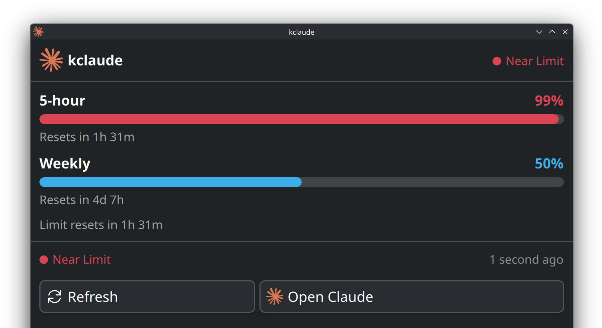
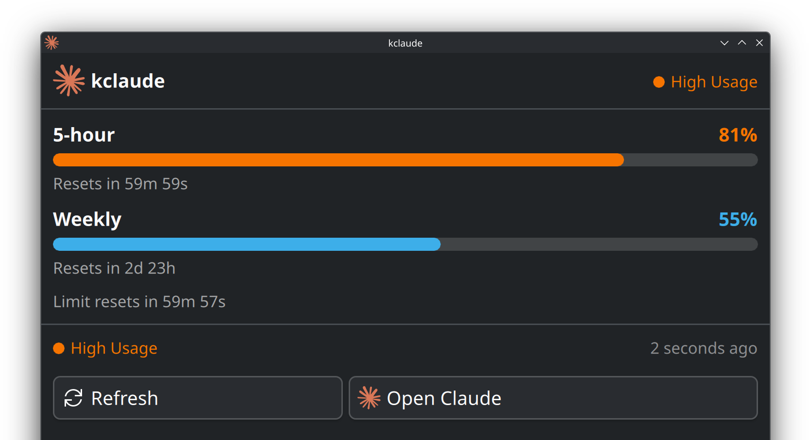
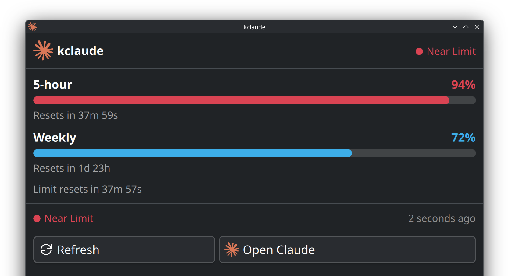
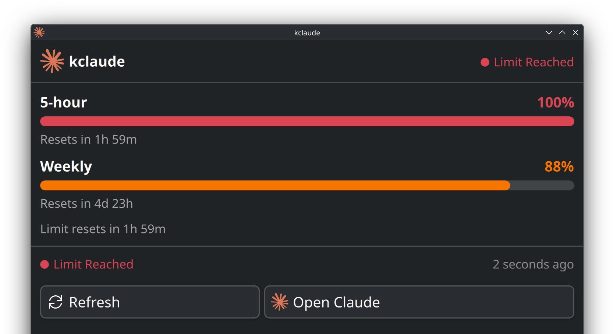
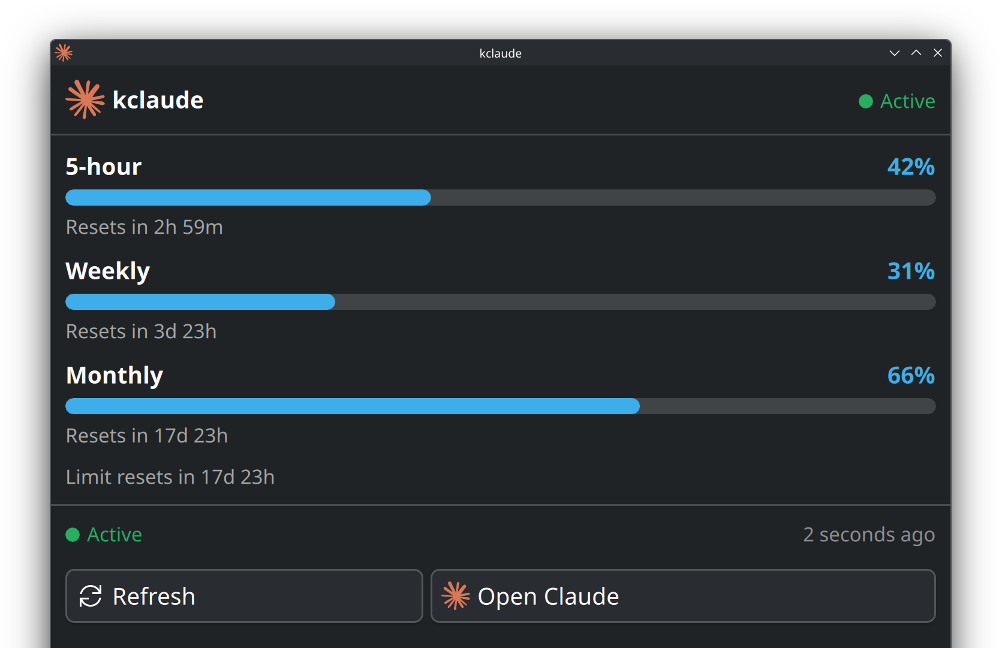
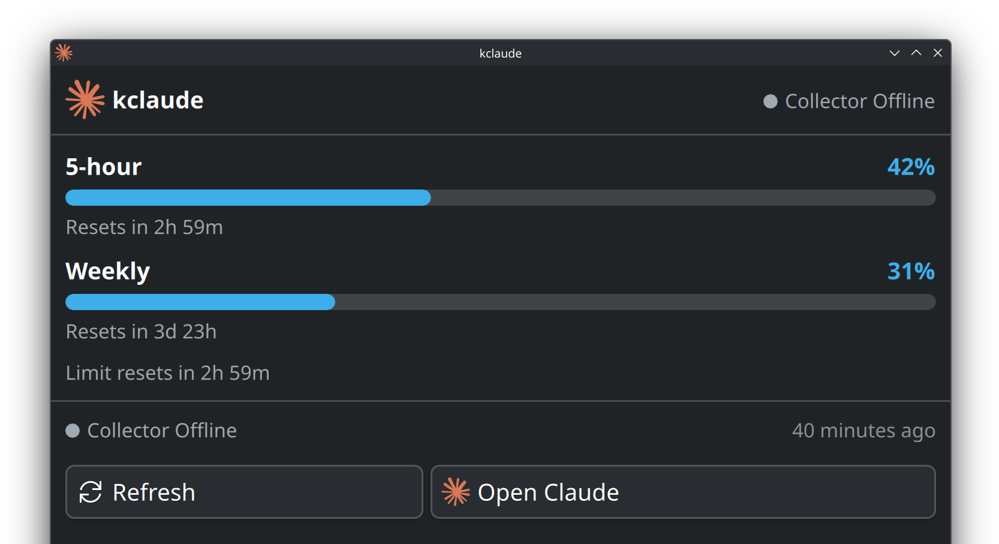
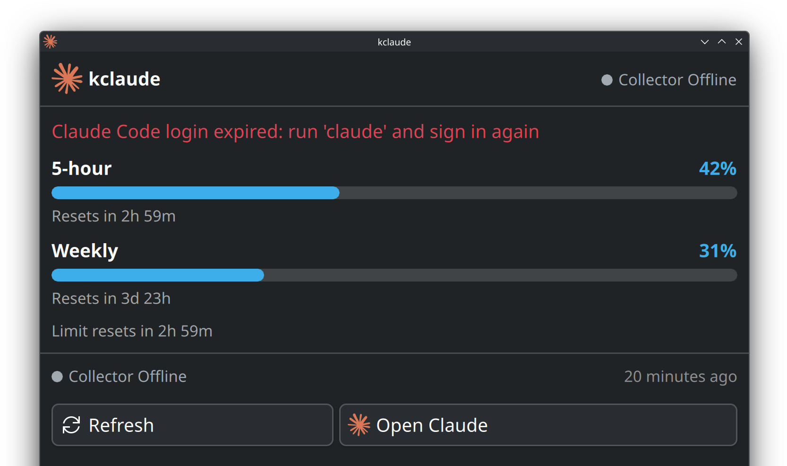
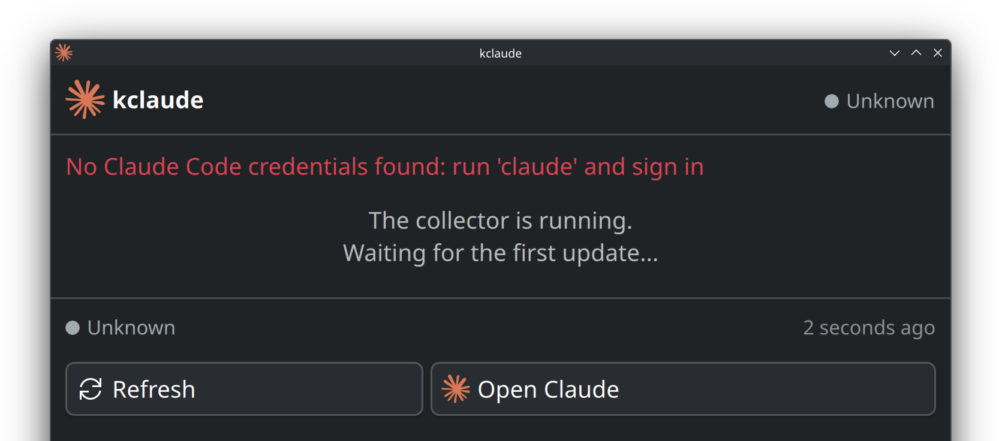
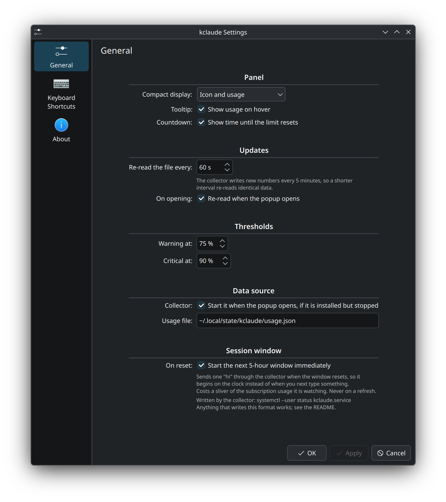

# kclaude

A KDE Plasma 6 panel widget that shows your Claude Code usage limits at a glance:
the five-hour, weekly and monthly windows — plus the Fable weekly budget on
plans that have one — with a colour-coded status dot, across as many Claude
accounts as you have logins for.

[](https://github.com/schiz0x00/kclaude/actions/workflows/ci.yml)
[](https://github.com/schiz0x00/kclaude/actions/workflows/packages.yml)
[](https://github.com/schiz0x00/kclaude/releases/latest)
[](LICENSE)
[](https://kde.org/plasma-desktop/)

<p align="center">
  
</p>

> **Disclaimer:** Unofficial third-party widget. Not affiliated with, endorsed by,
> or sponsored by Anthropic. "Claude" and "Claude Code" are trademarks of
> Anthropic. This project is not a product of Anthropic.

## Contents

- [Features](#features)
- [Screenshots](#screenshots)
- [Security: read this before installing the daemon](#security-read-this-before-installing-the-daemon)
- [Requirements](#requirements)
- [Installation](#installation)
- [Configuration](#configuration)
- [Data format](#data-format)
- [Daemon](#daemon)
- [Development](#development)
- [Layout](#layout)
- [Contributing](#contributing)
- [License](#license)

## Features

- Compact panel indicator with a colour-coded status dot
- Five-hour, weekly and monthly utilization, each with a progress bar
- Fable weekly budget, shown automatically on the plans that have one
- Each account's plan (Max, Pro, …) as a badge, so a plan with no Fable window
  reads as a plan rather than as a missing bar
- **Several accounts at once**, each in its own Claude config folder, all
  polled independently and shown side by side
- One account's expired login, failed poll or rate-limit backoff never holds up
  the others
- Configurable warning and critical thresholds (defaults 75% / 90%)
- Countdown to the next limit reset, ticking in real time
- Optional background collector that keeps the numbers current
- Optionally starts the next 5-hour window the moment the previous one resets
- No runtime dependencies beyond Plasma 6 and Python 3

## Screenshots

Every state below is reproducible: the widget renders whatever `usage.json`
says, so none of these needed a real limit to be hit.

| | |
| --- | --- |
| **Normal** — under the warning threshold<br> | **Warning** — past 75%<br> |
| **Critical** — past 90%<br> | **Spent** — the window is used up<br> |
| **Monthly window** — when the account reports one<br> | **Stale** — nothing has updated the file<br> |
| **Login expired** — last good numbers kept<br> | **First run** — nothing collected yet<br> |

<p align="center">
  
</p>

## Security: read this before installing the daemon

The widget makes no network calls of its own: it reads one JSON file per
account and draws them. Its only write is `~/.config/kclaude/accounts.json`, the
list of which files to read. **The optional collector daemon is the part that
touches your credentials.** Specifically it:

- Reads the OAuth token Claude Code stores in each configured account's
  `.credentials.json` — `~/.claude/.credentials.json` unless you add more in the
  **Accounts** settings page.
- Calls `POST https://api.anthropic.com/v1/messages` with that token once a
  minute — an 8-token Haiku message whose reply is discarded. The usage numbers
  come from the rate-limit headers on the response, which is the only way to get
  them without the far scarcer usage endpoint. **So the collector spends a
  little of your quota continuously**, about 9 tokens a minute, and each message
  opens a five-hour window if none is running.
- Falls back to `GET https://api.anthropic.com/api/oauth/usage` with that token
  when a ping fails.
- When the token has expired, refreshes it against
  `https://platform.claude.com/v1/oauth/token` using Claude Code's own OAuth
  client id, and **writes the refreshed token back to that same account's
  `.credentials.json`** — a file the daemon does not own. Each account's token is
  only ever written to its own file: there is no module-level path left to reach
  by accident, because two accounts sharing one credentials file would log each
  other out of Claude Code on every rotation.
- Identifies itself as `claude-cli` (user-agent, `x-app`, session-id header),
  since the token and the OAuth client id are Claude Code's either way.
- If you switch session priming on, one further `POST /v1/messages` per
  five-hour reset, **per account** — each under its own hourly floor. See
  [Starting the next 5-hour window on reset](#starting-the-next-5-hour-window-on-reset).

Consequences worth weighing:

- **These endpoints are undocumented and unversioned.** They can change or
  disappear without notice, and reusing Claude Code's OAuth client id may not be
  something Anthropic's terms permit. Treat this as a best-effort tool.
- **A token refresh rotates your refresh token.** That is why the daemon refuses
  to run twice (`flock` on `daemon.lock`): two copies refreshing at once would
  leave one holding a server-invalidated token, and writing that back would force
  you to re-authenticate Claude Code.
- **The credential file is shared, not owned.** The daemon re-reads it
  immediately before writing and replaces only the `claudeAiOauth` key, so the
  keys Claude Code owns survive. This narrows the race to microseconds but cannot
  eliminate it — Claude Code does not take the daemon's lock. With several
  accounts there is one such file per account and the same rule applies to each.
- **The settings dialog never reads a token.** It checks a candidate folder with
  `test -f` and nothing more, and shows the plan from the collector's own output
  file, so no OAuth token is ever pulled into the process that draws the dialog.
- **The collector sends inference requests, not just reads.** Reusing the OAuth
  client id to *ask Claude something* is a bigger imposition than reading a
  usage figure. Every such request draws on the subscription the token belongs
  to, and refuses to go out at all unless the credential is an OAuth token, so
  none of it can reach API billing. A window at 100% stops them entirely until
  it resets, rather than retrying into a refusal.
- Tokens never leave your machine except to the Anthropic endpoints above,
  are never logged, and the credential file is rewritten mode `0600`.

If none of that is acceptable, install the widget without `--with-daemon` and
write `usage.json` yourself (format below).

## Requirements

- KDE Plasma 6
- `kpackagetool6` (from `plasma-sdk` or `kpackage`)
- Python 3.9 or newer — only for the optional collector daemon

## Installation

### From a package

Grab the `.deb` or `.rpm` from the [latest
release](https://github.com/schiz0x00/kclaude/releases/latest):

```bash
sudo apt install ./kclaude_*_all.deb      # Debian, Ubuntu, KDE neon
sudo dnf install ./kclaude-*.noarch.rpm   # Fedora
sudo zypper install ./kclaude-*.noarch.rpm  # openSUSE
```

This installs the widget system-wide, so every user on the machine can add it.
The collector is installed but deliberately **not** enabled — it reads your
credentials, so turning it on stays your call:

```bash
systemctl --user enable --now kclaude.service
```

The same release also carries a `.plasmoid`: the widget on its own, no
collector, for a per-user install or the KDE Store.

```bash
kpackagetool6 --type Plasma/Applet --install kclaude-*.plasmoid
```

### From source

```bash
git clone https://github.com/schiz0x00/kclaude.git
cd kclaude
./scripts/install.sh
```

With the collector daemon (see the Security section first):

```bash
./scripts/install.sh --with-daemon
```

Then right-click the panel, choose **Add Widgets…**, and search for `kclaude`.

The script is safe to re-run to upgrade, and works non-interactively — piped or
in CI it takes the default for every prompt.

### Manual install

```bash
kpackagetool6 --type Plasma/Applet --install .
# optional: the icon already resolves from inside the package, but a copy in
# the icon theme makes it available to anything else that looks it up by name.
mkdir -p ~/.local/share/icons/hicolor/scalable/apps
cp contents/icons/kclaude.svg ~/.local/share/icons/hicolor/scalable/apps/kclaude.svg
```

### Uninstall

```bash
./scripts/uninstall.sh
```

Removing the widget never touches `~/.claude/`. The daemon and the collected
usage snapshot are each removed only if you confirm.

## Configuration

Right-click the widget → **Configure**:

| Setting | Default | Notes |
| --- | --- | --- |
| Compact display mode | Icon + Usage | Icon only, or with the name and/or percentage. The percentage is always the 5-hour session window; the dot still reflects the worst one |
| Refresh interval | 60 s | How often the widget re-reads the file, floored at 30 s |
| Refresh button | — | Re-reads the file *and* asks the collector to poll now |
| Warning threshold | 75% | Status turns amber at or above this |
| Critical threshold | 90% | Status turns red; always kept above the warning level |
| Usage file path | `~/.local/state/kclaude/usage.json` | The **primary** account's file. Every other account's is a `usage-<id>.json` beside it. The **Accounts** page reads this same setting, so a collector of your own works throughout |
| Refresh on popup open | on | Re-read the file when the popup opens |
| Start collector on popup open | on | Starts an installed-but-stopped collector. Never installs it |
| Start the next 5-hour window on reset | **off** | Sends one `hi` through the collector when the window resets. See below |
| Show tooltip | on | |
| Show reset countdown | on | |

### Several accounts

Right-click the widget → **Configure** → **Accounts**. Each entry is a Claude
config directory — the one holding `.claude.json`, as `~/.claude` does — and
each is polled on its own schedule with its own token, so a login that has
expired on one leaves the others updating.

- **Scan home folder** finds `~/.claude*` directories for you. **Add folder…**
  takes any path, and checks for a `.credentials.json` before accepting it.
- **The label is yours.** It defaults to the folder's own name. Two accounts
  need to be told apart at a glance, and the credentials do not say which is
  which: there is no account name or email in that file to read.
- **Order matters.** The first entry is the primary account, and it is the one
  that keeps the plain `usage.json` path — so a collector of your own, or an
  existing setup that reads that file, goes on working untouched. The rest get
  `usage-<id>.json` beside it.
- **No restart.** The collector re-reads the list once per poll, so a change
  takes effect within a minute. Adding an account does not disturb the others'
  pacing, and removing one does not reset the rest.

The panel shows every account's five-hour window, in order, separated by `·` —
`82% · 0%` — because one number for "whichever is worst" would leave the panel
silent about the fact that there is a second account. The popup gives each one a
section with its own bars, its own plan badge, and its own countdowns: the two
five-hour windows genuinely reset hours apart, so a single merged list of bars
would read as one account with six limits.

Removing an account stops it being polled and hides it, and leaves its
`usage-<id>.json` behind for you to delete — nothing under `~/.claude/` is ever
touched.

The list lives in `~/.config/kclaude/accounts.json`:

```json
{
  "version": 1,
  "accounts": [
    { "id": "personal", "label": "Max", "path": "/home/you/.claude" },
    { "id": "dad",      "label": "Dad", "path": "/home/you/.claude-dad" }
  ]
}
```

You can edit it by hand. A file that is missing, empty or unreadable falls back
to the single `~/.claude` account this widget has always shown, and a malformed
entry is dropped with a reason in the journal rather than taking the others down
with it. Both sides cap the list at 8.

Two paths to know about. The widget writes both out in full — it looks for
`~/.config/kclaude/accounts.json` and defaults its usage file to
`~/.local/state/kclaude/usage.json` — while the collector follows
`XDG_CONFIG_HOME` and `XDG_STATE_HOME`. So on a machine where either variable is
set, the two halves disagree until you make them agree: set the General page's
usage file path to `$XDG_STATE_HOME/kclaude/usage.json`, and make the accounts
list reachable at `~/.config/kclaude/accounts.json` (a symlink is enough). With
neither variable set, which is the usual case, there is nothing to do.

**The cost scales with the number of accounts.** Each one is pinged every 60 s
and has its own budget for the scarce usage endpoint, so two accounts cost
roughly twice one — 8 input tokens and 1 output token of Haiku per minute each.

### Starting the next 5-hour window on reset

The five-hour window does not run on a fixed schedule: it starts when you send
your first message, so a late start pushes the whole window (and every one after
it) later into the day. With this on, the widget notices the window expiring and
asks the collector to send a single `hi`, which opens the next one on the clock
instead.

Off by default, because it spends a little of the usage it is watching. What it
does and does not do:

- **One message per expiry.** The widget arms only on a five-hour window it saw
  while that window was still running, and settles that window as soon as one
  message goes out. The collector refuses a second prime within an hour
  regardless — a floor it keeps on disk, so a restart loop cannot reset it — and
  so a bug upstream of it cannot turn into a stream of requests.
- **Retried for ten minutes, then dropped.** If the collector is not up yet at
  the moment of the reset, the widget keeps asking on its 30-second tick until
  one gets through. Ten minutes past the reset it gives up: by then the window
  is well under way and a late message would spend for nothing.
- **Never on a refresh.** Neither the refresh timer, nor opening the popup, nor
  the **Refresh** button can prime. Refresh is `SIGUSR1` (poll the usage
  endpoint); priming is `SIGUSR2`, and the only thing that raises it is a window
  expiring. `tests/tst_primer.qml` pins this.
- **Subscription usage, never API billing.** The request carries the Claude Code
  OAuth token (`sk-ant-oat…`) and nothing else — no `x-api-key`, and the daemon
  reads no `ANTHROPIC_API_KEY` anywhere. Before sending, it checks that the
  credential really is an OAuth token and refuses outright otherwise, so an API
  key (`sk-ant-api…`) in that file can never be spent. An unrecognised prefix
  also refuses rather than guessing which account pays.
- **`max_tokens: 1` on the cheapest model.** The reply is thrown away; only the
  fact of the request matters. Not `max_tokens: 0` — that generates nothing, and
  the window needs a real completion.
- Nothing happens if plasmashell is not running at the moment of the reset, or if
  the collector stays down for the whole ten minutes — it holds the token, so
  there is no other path.

To do it by hand, with or without the setting:

```bash
systemctl --user kill -s USR2 kclaude.service   # collector running
~/.local/bin/kclaude-daemon --prime-now         # collector stopped
```

Priming is logged to the journal, including the model that served it and the
reason when it fails.

When the popup opens, the widget starts the collector if it is installed but
not running, then picks up the first numbers a few seconds later. It will not
install the collector for you: that would mean dropping an executable and a
systemd unit that read your credentials, which stays your explicit call. If the
unit is missing, the popup says so and shows the command. Turn the auto-start off
in the settings if you would rather drive it yourself.

The widget reads a file; it never makes network calls itself. The collector
writes that file every 60 s, so a refresh interval below 60 s only re-reads
identical data. Data older than 15 minutes is shown as stale rather than fresh.

The numbers come from the rate-limit headers on a tiny message the collector
sends to `/v1/messages` — 8 input tokens and 1 output token of Haiku, the same
source Claude Code's own `/usage` bars use. `/api/oauth/usage` is a fallback
only: its quota is far too small to poll. One consequence: that message opens a
five-hour window when none is running, so one stays open around the clock.

## Data format

Anything can write `usage.json` — the daemon is one option. `utilization` is a
fraction from 0.0 to 1.0, and `resetAt` is an ISO-8601 timestamp:

```json
{
    "windows": {
        "five_hour": { "utilization": 0.68, "resetAt": "2026-07-30T18:00:00Z" },
        "seven_day": { "utilization": 0.41, "resetAt": "2026-08-03T00:00:00Z" },
        "fable": {
            "utilization": 0.22,
            "resetAt": "2026-08-03T00:00:00Z",
            "updatedAt": "2026-07-30T13:07:00Z"
        }
    },
    "updatedAt": "2026-07-30T13:37:00Z",
    "plan": "max",
    "account": "claude"
}
```

An optional top-level `"plan"` is shown as a badge next to the account name. The
daemon writes it because it is the only thing that reads the credentials, and
`tests/tst_provider.qml` pins that only `max`, `pro`, `team` and `enterprise` are
shown — anything else becomes no badge, so a hand-written file cannot put
arbitrary text on the panel.

An optional top-level `"account"` is the id the numbers belong to. The *filename*
carries an id too, but that one follows the account's position in the list, so
reordering the accounts moves a filename between accounts for a poll interval.
This key does not move: the widget refuses a file that names a different
account rather than drawing it. Omit it and the file is taken at its word, so a
hand-written file — or one from a collector older than this key — keeps working
unchanged.

With more than one account configured there is one such file per account. The
first is `usage.json` as above; the rest are `usage-<id>.json` beside it, named
after the id in `accounts.json`. Each is independent, so a corrupt or missing
one only affects its own row. Ids are lowercased, reduced to ASCII letters and
digits, and capped at 64 characters so the filename always fits; a non-ASCII id
is not transliterated, it is truncated at the first character that is not one.

Unknown window keys are accepted and title-cased for display. Malformed entries
are skipped rather than shown as 0%. An optional top-level `"error"` string is
shown as a banner in the popup — the daemon uses it when Claude Code's login
has expired and only the user can fix it. See
[docs/architecture.md](docs/architecture.md) for the full contract.

A window may carry its own `updatedAt` when the collector reads it less often
than it writes the file — the popup then says how old that one number is
instead of presenting it as live. Windows without it are exactly as fresh as
the file.

## Daemon

```bash
# status and logs
systemctl --user status kclaude.service
journalctl --user -u kclaude.service -f

# run in the foreground, custom interval in seconds (minimum 60)
~/.local/bin/kclaude-daemon 300

# stop collecting
systemctl --user disable --now kclaude.service
```

Only one instance runs at a time; a second exits immediately, by design. On
errors it backs off exponentially up to an hour and honours `Retry-After`.
When the Claude Code login itself has expired, the popup says so — run
`claude`, sign in again, and hit **Refresh**; the daemon picks the new
credentials up on its own.

`SIGUSR1` cuts the poll interval short, which is what the widget's **Refresh**
button uses to get fresh numbers without restarting the collector:

```bash
systemctl --user kill -s USR1 kclaude.service
```

Manually requested polls are floored at 30s apart, and a refresh request will not
short-circuit an error backoff. The usage endpoint returns `429 Too Many Requests`
well below one call every 30s, so both limits matter.

`SIGUSR2` is the other half: send one message to open a new five-hour window.
This is the only thing the daemon does that spends usage, it is floored at one
per hour, and `SIGUSR1` can never trigger it.

```bash
systemctl --user kill -s USR2 kclaude.service
~/.local/bin/kclaude-daemon --prime-now   # only if no daemon is running
```

`--prime-now` takes the same lock the daemon holds and refuses if one is already
running, rather than risk two processes refreshing the token at once.

## Development

```bash
node tests/shell-quote.test.js       # shell quoting, checked against a real bash
node tests/accounts.test.js         # account id/filename rules + the settings page's commands
node tests/package-layout.test.js    # package layout and config wiring
python3 daemon/kclaude-daemon --selftest
qmllint contents/ui/*.qml contents/code/*.qml contents/config/*.qml
shellcheck scripts/*.sh

# QML behaviour, run against Qt's own engine and the real Plasma imports.
# tst_service talks to the real systemd user manager (and stops/restarts
# kclaude.service if installed); the other suites are hermetic.
for t in tests/tst_*.qml; do
    QT_QPA_PLATFORM=offscreen qmltestrunner -input "$t"
done

# iterate on the widget in a standalone window
kpackagetool6 --type Plasma/Applet --upgrade . && plasmawindowed io.github.schiz0x00.kclaude
```

Building the `.deb` and `.rpm` needs [nfpm](https://nfpm.goreleaser.com/) on
`PATH` (`go install github.com/goreleaser/nfpm/v2/cmd/nfpm@latest`). The
`.plasmoid` is built before that step, so it works without one:

```bash
./scripts/build-packages.sh   # -> dist/*.plasmoid, dist/*.deb, dist/*.rpm
```

Version comes from `metadata.json`; pushing a `v*` tag builds all three and
attaches them to the GitHub release.

plasmashell caches applet QML, so `systemctl --user restart
plasma-plasmashell.service` is needed to see changes in the panel. `install.sh`
offers to do it.

CI runs everything except `tst_service` (see
[docs/testing.md](docs/testing.md)). More docs:

- [docs/architecture.md](docs/architecture.md) — components, the usage.json
  contract, and the reasoning behind the odd-looking decisions
- [docs/testing.md](docs/testing.md) — what each suite pins and why
- [docs/i18n.md](docs/i18n.md) — how strings are translated and how to add a
  language

## Layout

```text
metadata.json                 Plasma package metadata
CHANGELOG.md                  what changed, per release
CONTRIBUTING.md               how to build, test and send a patch
SECURITY.md                   what the daemon touches, and how to report a hole
contents/
  ui/                         main.qml, compact + full representations, UsageBar, StatusIndicator
  code/                       UsageModel, FileUsageProvider, AccountList, OneShotReader,
                              ServiceControl, SessionPrimer, Shell.js, Accounts.js, TimeUtils.js
  config/                     main.xml + the configuration form
  icons/kclaude.svg
daemon/
  kclaude-daemon              collector (Python 3, stdlib only)
  kclaude.service             systemd user unit
scripts/                      install.sh, uninstall.sh, build-packages.sh
packaging/                    nfpm.yaml + postinstall for the .deb and .rpm
docs/                         architecture, testing, i18n
  screenshots/                every widget state, one PNG each
tests/
  shell-quote.test.js         shell quoting vs a real bash (node)
  accounts.test.js            account id/filename rules, and the commands the
                              accounts page runs (node)
  package-layout.test.js      config page location, cfg wiring, package id (node)
  tst_config.qml              general config page renders, every setting is wired
  tst_configaccounts.qml      accounts page renders, and the list-editing rules
  tst_accounts.qml            accounts.json parsing and per-account file paths
  tst_provider.qml            usage.json parsing, incl. "error" and "plan"
  tst_refresh.qml             read coalescing and wedge recovery, real engine
  tst_primer.qml              when a new 5-hour window is opened, and when not
  tst_service.qml             collector detection and auto-start
  tst_timeutils.qml           timestamp parsing and formatting
  fixtures/usage.json         a real file for tst_refresh to point the dataengine at
.github/workflows/
  ci.yml                      tests and linters, everything except tst_service
  packages.yml                builds the .plasmoid, .deb and .rpm, attaches them to v* tags
```

## Contributing

Patches welcome — see [CONTRIBUTING.md](CONTRIBUTING.md) for the development
setup, the checks CI runs, and the two rules worth knowing before you start
(the widget never touches the network; the collector only ever spends
subscription quota). Release history is in [CHANGELOG.md](CHANGELOG.md).

Found a security problem? Report it privately: see [SECURITY.md](SECURITY.md).

## License

MIT — see [LICENSE](LICENSE).
